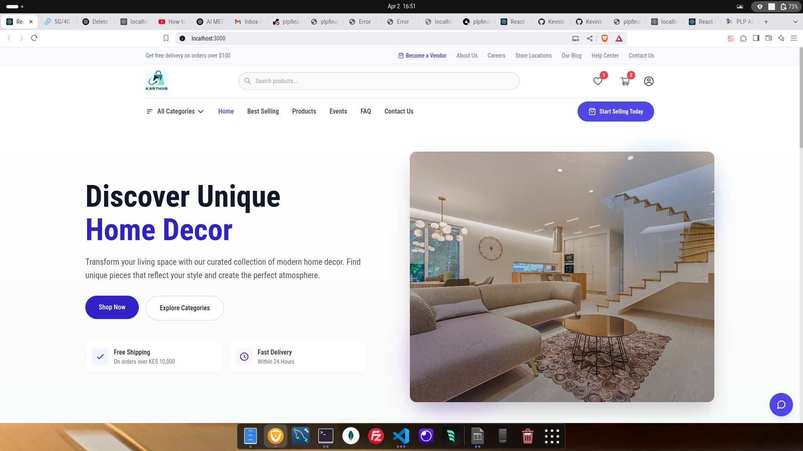
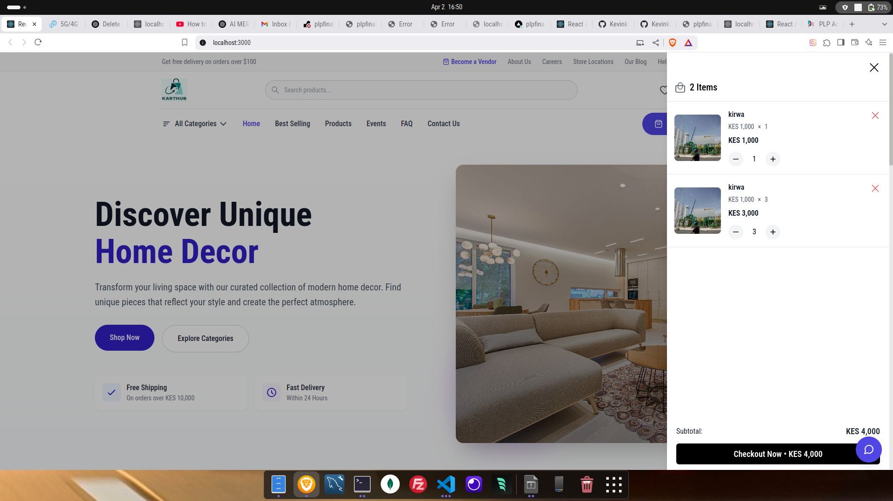

# PLP Final Project - E-commerce Platform

## Project Overview
A full-stack e-commerce platform built with the MERN stack (MongoDB, Express.js, React.js, Node.js). This platform enables users to browse products, make purchases, and manage their orders, while providing vendors with tools to manage their products and sales.

## Live Demo
- Frontend: [https://plpfinalproject.vercel.app](https://plpfinalproject.vercel.app)
- Backend API: [https://plpfinalproject-2.onrender.com](https://plpfinalproject-2.onrender.com)

## Features List

### User Features
- User Authentication (Login/Register with email verification)
- Profile Management
- Shopping Cart
- Order Tracking
- Wishlist
- Real-time Chat Support
- Secure Payment Processing

### Vendor Features
- Vendor Registration and Dashboard
- Product Management (Add, Edit, Delete)
- Order Management
- Sales Analytics
- Inventory Tracking

### Admin Features
- User Management
- Vendor Management
- Product Moderation
- Order Management
- Analytics Dashboard
- System Settings

### Technical Features
- Responsive Design (Mobile & Desktop)
- Real-time Updates
- Secure Payment Integration
- Image Upload and Management
- Search and Filter Functionality
- Email Notifications

## Installation and Usage Guide

### Prerequisites
- Node.js (v14 or higher)
- MongoDB
- npm or yarn

### Installation Steps

1. Clone the repository:
   ```bash
   git clone https://github.com/Kevinkirwa/plpfinalproject.git
   cd plpfinalproject
   ```

2. Install dependencies:
   ```bash
   npm run install-all
   ```

3. Set up environment variables:
   
   Backend (.env):
   ```
   PORT=8000
   DB_URL=your_mongodb_url
   JWT_SECRET_KEY=your_jwt_secret
   JWT_EXPIRES=7d
   ACTIVATION_SECRET=activation_secret
   SMTP_HOST=smtp.gmail.com
   SMTP_PORT=587
   SMTP_PASSWORD=smtp_password
   SMTP_MAIL=smtp_email
   STRIPE_API_KEY=stripe_api_key
   STRIPE_SECRET_KEY=stripe_secret_key
   FRONTEND_URL=frontend_url
   ```

   Frontend (.env):
   ```
   REACT_APP_API_URL=http://localhost:8000
   REACT_APP_SOCKET_SERVER=ws://localhost:8000
   ```

4. Run the development servers:
   ```bash
   npm run dev
   ```

### Usage Guide
1. Start the application by visiting `http://localhost:3000`
2. Register a new account or login with existing credentials
3. Browse products, add items to cart, and proceed to checkout
4. For vendors, register as a seller to manage products and orders
5. For admins, use the admin dashboard to manage the platform

## API Documentation

### Authentication Endpoints
- `POST /api/v2/user/create-user` - Register new user
- `POST /api/v2/user/login-user` - User login
- `POST /api/v2/user/verify-otp` - Verify email OTP
- `POST /api/v2/user/resend-otp` - Resend verification OTP

### Product Endpoints
- `GET /api/v2/product/get-all-products` - Get all products
- `GET /api/v2/product/get-product/:id` - Get single product
- `POST /api/v2/product/create-product` - Create new product
- `PUT /api/v2/product/update-product/:id` - Update product
- `DELETE /api/v2/product/delete-product/:id` - Delete product

### Order Endpoints
- `POST /api/v2/order/create-order` - Create new order
- `GET /api/v2/order/get-all-orders` - Get all orders
- `GET /api/v2/order/get-seller-orders` - Get seller orders
- `PUT /api/v2/order/update-order-status` - Update order status

### Payment Endpoints
- `POST /api/v2/payment/create-payment` - Create payment
- `POST /api/v2/payment/verify-payment` - Verify payment

## Screenshots

### Homepage


### Product Listing


### Shopping Cart


### User Dashboard


### Admin Panel


## Tech Stack

### Frontend
- React.js
- Redux for state management
- Tailwind CSS for styling
- Socket.io-client for real-time features
- Axios for API calls

### Backend
- Node.js & Express.js
- MongoDB with Mongoose
- JWT for authentication
- Socket.io for real-time communication
- Nodemailer for email services

## Deployment

The project is configured for deployment with:
- Backend: Render.com
- Frontend: Vercel

### Backend Deployment (Render)
- Connect your GitHub repository
- Use the following settings:
  - Root Directory: backend
  - Build Command: npm install
  - Start Command: npm start

### Frontend Deployment (Vercel)
- Connect your GitHub repository
- Use the following settings:
  - Root Directory: frontend
  - Framework Preset: Create React App
  - Build Command: npm run build
  - Output Directory: build

## Contributing

1. Fork the repository
2. Create your feature branch
3. Commit your changes
4. Push to the branch
5. Open a pull request

## License

This project is licensed under the ISC License.

## Author

Kevin Kirwa
